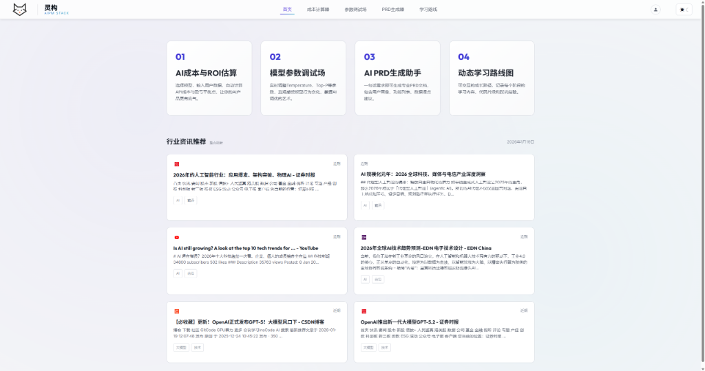
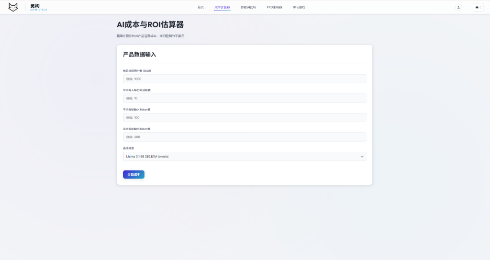
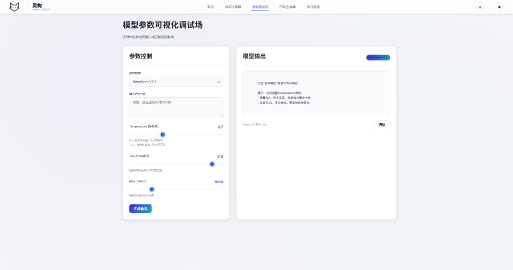
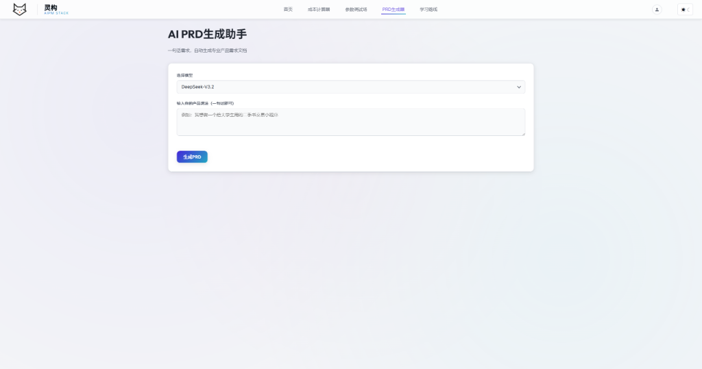
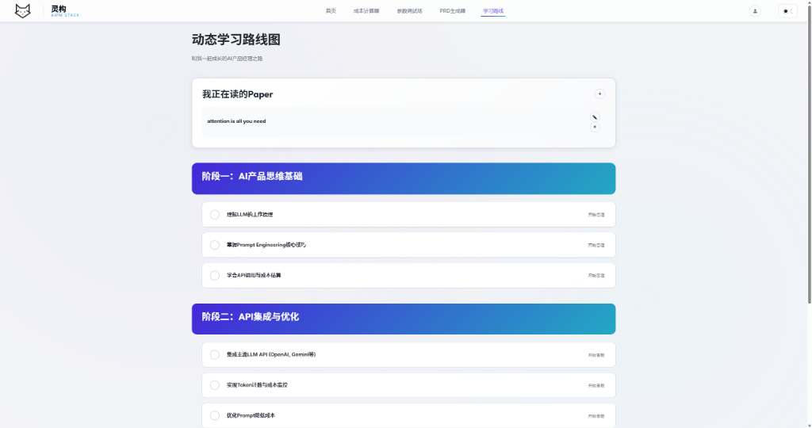

[README.md](https://github.com/user-attachments/files/24708087/README.md)
# Spirit Construct | 灵构 AIPM STACK

> 面向 AI 产品经理的一站式能力培养平台

[](https://spirit-construct-aipm-stack.pages.dev)
[](https://supabase.com)

## 预览

| 首页 | 成本计算器 |
|:---:|:---:|
|  |  |

| 参数调试场 | PRD生成器 |
|:---:|:---:|
|  |  |

| 学习路线图 |
|:---:|
|  |

---

## 功能特性

### 已完成功能

| 模块 | 功能 | 状态 |
|------|------|------|
| **AI 成本计算器** | 选择模型、输入用户参数，自动计算 API 成本与 ROI | 完成 |
| **模型参数调试场** | 实时调整 Temperature/Top-P/Max Tokens，流式输出 | 完成 |
| **AI PRD 生成器** | 一句话生成结构化产品需求文档 | 完成 |
| **学习路线图** | AIPM 能力成长路径，支持进度追踪 | 完成 |
| **论文阅读列表** | 收藏管理 AI/PM 相关论文 | 完成 |
| **用户认证** | Google OAuth 登录 | 完成 |
| **主题切换** | 深色/浅色模式无缝切换 | 完成 |

### 开发中 / 待优化

| 功能 | 描述 | 优先级 |
|------|------|--------|
| **云端数据同步** | Supabase 用户数据持久化 | 高 |
| **移动端适配** | 响应式布局优化 | 中 |
| **测验系统** | AIPM 知识测评与练习 | 中 |
| **学习数据分析** | 用户学习进度可视化 | 低 |

---

## 技术栈

```
前端: HTML5 + CSS3 + Vanilla JavaScript
UI: 自定义设计系统（支持深色/浅色主题）
认证: Supabase Auth (Google OAuth)
数据库: Supabase PostgreSQL (开发中)
部署: Cloudflare Pages
AI API: SiliconFlow (Qwen, GLM-4 等模型)
```

---

## 快速开始

### 本地运行

```bash
# 克隆项目
git clone https://github.com/Maropion03/Spirit-Construct-AIPM-stack.git
cd Spirit-Construct-AIPM-stack

# 启动本地服务器
python -m http.server 8000
# 或
npx serve .

# 访问 http://localhost:8000
```

### 配置 API Key

1. 打开 `config.js`
2. 替换 `apiKey` 为你的 [SiliconFlow API Key](https://cloud.siliconflow.cn/account/ak)

```javascript
const API_CONFIG = {
    baseURL: 'https://api.siliconflow.cn/v1',
    apiKey: 'YOUR_API_KEY_HERE',  // <- 替换这里
    ...
};
```

---

## 项目结构

```
├── index.html          # 主页面
├── login.html          # 登录页面
├── index.css           # 主样式表（含主题变量）
├── login.css           # 登录页样式
├── app.js              # 核心应用逻辑
├── auth.js             # 认证逻辑
├── config.js           # API 配置
├── quiz_data.js        # 测验数据
├── assets/             # 图片资源
└── cloudflare-worker/  # Cloudflare Worker 配置
```

---

## 可优化方向

### 短期优化

1. **数据同步稳定性**
   - 完善 Supabase 数据读写逻辑
   - 解决多账号数据隔离问题

2. **用户体验**
   - 添加加载状态反馈
   - 优化错误提示信息

### 中期优化

3. **功能扩展**
   - 完善测验系统
   - 添加学习进度统计
   - 支持导出学习报告

4. **性能优化**
   - 代码分割与懒加载
   - 静态资源 CDN 优化

### 长期规划

5. **社区功能**
   - 用户论文/资源分享
   - 学习小组/讨论区

6. **AI 能力增强**
   - 更多 AI 工具模块
   - 个性化学习推荐

---

## 使用的模型

| 模型 | 用途 | 费用 |
|------|------|------|
| `Qwen/Qwen2.5-7B-Instruct` | 参数调试场 | 免费 |
| `Pro/zai-org/GLM-4.7` | PRD 生成器 | 按量计费 |
| `Qwen/Qwen2.5-Coder-7B-Instruct` | 代码生成 | 免费 |

---

## License

MIT License

---

## 致谢

- [SiliconFlow](https://siliconflow.cn) - AI 模型 API
- [Supabase](https://supabase.com) - 认证与数据库
- [Cloudflare](https://cloudflare.com) - 部署托管
